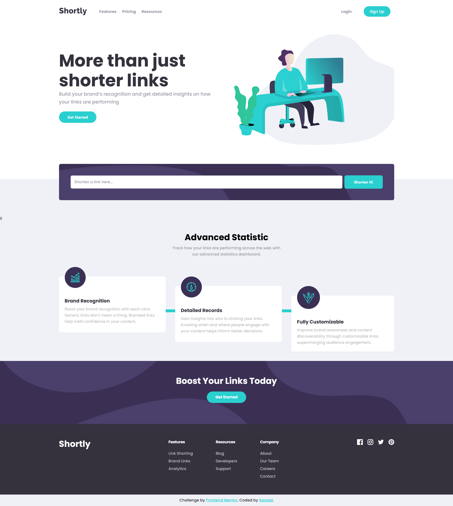

# Frontend Mentor - Shortly URL shortening API Challenge solution

This is a solution to the [Shortly URL shortening API Challenge challenge on Frontend Mentor](https://www.frontendmentor.io/challenges/url-shortening-api-landing-page-2ce3ob-G). But instead of using an external api, I created my own `API`.

## Table of contents

- [Overview](#overview)
  - [The challenge](#the-challenge)
  - [Screenshots](#screenshots)
  - [Links](#links)
- [My process](#my-process)
  - [Built with](#built-with)
  - [What I learned](#what-i-learned)
  - [Continued development](#continued-development)
- [Author](#author)
- [Acknowledgments](#acknowledgments)

## Overview

### The challenge

Users should be able to:

- View the optimal layout for the site depending on their device's screen size
- Shorten any valid URL
- See a list of their shortened links, even after refreshing the browser
- Copy the shortened link to their clipboard in a single click
- Receive an error message when the `form` is submitted if:
  - The `input` field is empty

## Screenshots

### **Desktop View**

### Links

- Solution URL: [Solution URL](#)
- Live Site URL: [Live Site URL](https://cutly.netlify.app/)
- Frontend Repo: [Frontend URL](https://github.com/sazzad4677/cutly-frontend)
- Backend Repo: [Backend URL](https://github.com/sazzad4677/cutly-backend)

## My process

### Built with
- Semantic HTML5 markup
- CSS custom properties
- CSS Flexbox
- Mobile-first workflow
- [React](https://reactjs.org/) - JS library
- [React Router](https://reactrouter.com/)
- [Tailwind CSS](https://tailwindcss.com/) - Utility-first CSS framework
- [Node JS](https://nodejs.org/en/)
- [Express JS](https://expressjs.com/) - Web framework for Node.js
- [MongoDB](https://www.mongodb.com/) - NoSQL database
- [Mongoose js](https://mongoosejs.com/) - Mongodb object modeling for node.js

### What I learned

- I was able to reinforce my knowledge of flexbox and obtain a better understanding of how it works.
- I learned how to utilize a custom hook to prevent duplicating code.
- I learned how shorten an URL and Redirect them.
- I learned how to build an API
- I learned how to work MVC Design Pattern in Express JS.
- I learned about Error handling

### Continued development
 - Users should be able to create an account and log in to check how many clicks they have on their dashboard.

## Author

- Linkedin - [Md. Sazzad Hossain](https://www.linkedin.com/in/sazzad4673/)
- Frontend Mentor - [@sazzad4677](https://www.frontendmentor.io/profile/sazzad4677)
